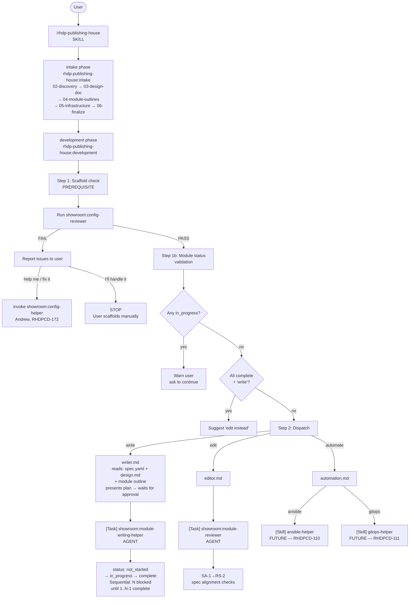

# Development Workflow Diagram

This diagram is the authoritative reference for the RHDP Publishing House development phase.
Source of truth: `rhpds/rhdp-publishing-house` → `docs/superpowers/specs/2026-06-29-ph-skills-consolidation-architecture.md`

## Mermaid Diagram



## ASCII Diagram

```
User
  │
  └─ /rhdp-publishing-house (SKILL)
      │
      ├─ intake phase ─────────────────────────────────────────────┐
      │   rhdp-publishing-house:intake                             │
      │   └─ 02-discovery → 03-design-doc → 04-module-outlines    │
      │      → 05-infrastructure → 06-finalize                    │
      └────────────────────────────────────────────────────────────┘
      │
      ├─ development phase ────────────────────────────────────────┐
      │   rhdp-publishing-house:development                        │
      │                                                            │
      │   Step 1: Scaffold check (PREREQUISITE)                    │
      │   └─ Run showroom:config-reviewer                          │
      │      ├─ PASS → proceed to Step 1b                          │
      │      └─ FAIL → report issues to user                       │
      │               └─ User says "help me" / "fix it"            │
      │                  → invoke showroom:config-helper            │
      │                    (Andrew, RHDPCD-172)                     │
      │               └─ User says "I'll handle it"                │
      │                  → STOP. User scaffolds manually.           │
      │                                                            │
      │   Step 1b: Module status validation                        │
      │   └─ Read spec.yaml module statuses                        │
      │      ├─ Any in_progress? → warn user, ask to continue      │
      │      ├─ All complete + "write"? → "All done, edit instead?"│
      │      └─ Otherwise → proceed to Step 2                      │
      │                                                            │
      │   Step 2: Dispatch                                         │
      │   ├─ "write"  → writer.md                                  │
      │   │   ├─ reads: spec.yaml + design.md + module outline     │
      │   │   ├─ presents plan → waits for approval                │
      │   │   ├─ [Task] showroom:module-writing-helper (AGENT)     │
      │   │   └─ status: not_started → in_progress → complete      │
      │   │       └─ Sequential: N blocked until 1..N-1 complete   │
      │   │                                                        │
      │   ├─ "edit"   → editor.md                                  │
      │   │   ├─ [Task] showroom:module-reviewer (AGENT)           │
      │   │   └─ SA-1→RS-2 spec alignment checks                   │
      │   │                                                        │
      │   └─ "automate" → automation.md                            │
      │       ├─ [Skill] ansible-helper  (FUTURE — RHDPCD-110)     │
      │       └─ [Skill] gitops-helper   (FUTURE — RHDPCD-111)     │
      └────────────────────────────────────────────────────────────┘
```

## Legend

| Marker | Meaning |
|---|---|
| `[Task]` | Agent invocation via Task tool with `subagent_type` parameter |
| `[Skill]` | Skill invocation via Skill tool |
| `FUTURE` | Not yet built — dispatch path is wired but destination skill does not exist yet |

**Note:** FTL (`ftl:*`) is NOT in this diagram. Mitesh owns FTL validation separately as a standalone workflow.
