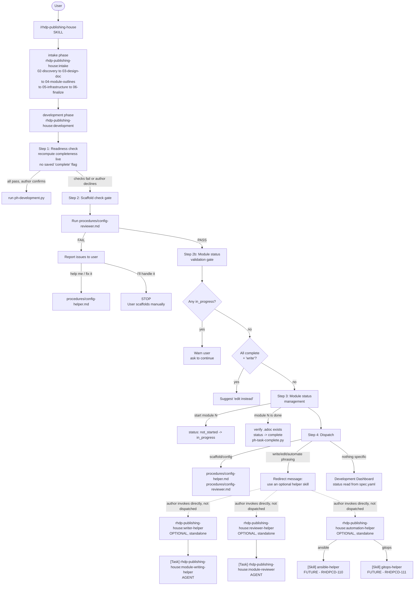

# Development Workflow Diagram

This diagram is the authoritative reference for the RHDP Publishing House development phase, after
the Phase 3 refactor that stripped the `development` skill down to scaffolding, module status
tracking, and Central submission. Writing, reviewing, and automation are optional standalone helper
skills the author invokes directly — `development` no longer dispatches to them.

## Mermaid Diagram



## ASCII Diagram

```
User
  |
  +- /rhdp-publishing-house (SKILL)
      |
      +- intake phase --------------------------------------------------+
      |   rhdp-publishing-house:intake                                  |
      |   +- 02-discovery -> 03-design-doc -> 04-module-outlines        |
      |      -> 05-infrastructure -> 06-finalize                        |
      +-------------------------------------------------------------------+
      |
      +- development phase (SCAFFOLDING ONLY) ---------------------------+
      |   rhdp-publishing-house:development                              |
      |                                                                  |
      |   Step 1: Readiness check (recomputed live, no saved flag)       |
      |   +- all pass + author confirms -> run ph-development.py         |
      |   +- otherwise -> Step 2                                        |
      |                                                                  |
      |   Step 2: Scaffold check gate                                    |
      |   +- Run procedures/config-reviewer.md                          |
      |      +- PASS -> proceed to Step 2b                              |
      |      +- FAIL -> report issues to user                           |
      |               +- "help me" -> procedures/config-helper.md       |
      |               +- "I'll handle it" -> STOP                       |
      |                                                                  |
      |   Step 2b: Module status validation gate                        |
      |                                                                  |
      |   Step 3: Module status management (AUTHORITATIVE, in SKILL.md) |
      |   +- "start module N" -> status: in_progress                    |
      |   +- "module N is done" -> verify .adoc exists, status: complete|
      |      -> ph-task-complete.py                                   |
      |                                                                  |
      |   Step 4: Dispatch                                              |
      |   +- scaffold/config -> config-helper.md / config-reviewer.md   |
      |   +- write/edit/automate phrasing -> redirect to optional helper|
      |   +- nothing specific -> Development Dashboard                  |
      +---------------------------------------------------------------+
      |
      +- optional helper skills (NOT dispatched by development) --------+
      |   rhdp-publishing-house:writer-helper                            |
      |   +- reads spec.yaml + design.md + module outline               |
      |   +- presents plan -> waits for approval                        |
      |   +- [Task] rhdp-publishing-house:module-writing-helper (AGENT) |
      |   +- may set status: in_progress (bookkeeping only)             |
      |   +- never sets status: complete, never submits to Central      |
      |                                                                  |
      |   rhdp-publishing-house:reviewer-helper                          |
      |   +- [Task] rhdp-publishing-house:module-reviewer (AGENT)       |
      |   +- SA-1 -> RS-2 spec alignment checks                         |
      |                                                                  |
      |   rhdp-publishing-house:automation-helper                       |
      |   +- ansible -> [Skill] ansible-helper (FUTURE - RHDPCD-110)    |
      |   +- gitops  -> [Skill] gitops-helper  (FUTURE - RHDPCD-111)    |
      +---------------------------------------------------------------+
```

## Legend

| Marker | Meaning |
|---|---|
| `[Task]` | Agent invocation via Task tool with `subagent_type` parameter |
| `[Skill]` | Skill invocation via Skill tool |
| `FUTURE` | Not yet built — dispatch path is wired but destination skill does not exist yet |
| `OPTIONAL, standalone` | Not dispatched by `development` — the author invokes it directly whenever they want |

**Note:** FTL (`ftl:*`) is NOT in this diagram. Mitesh owns FTL validation separately as a standalone workflow.
