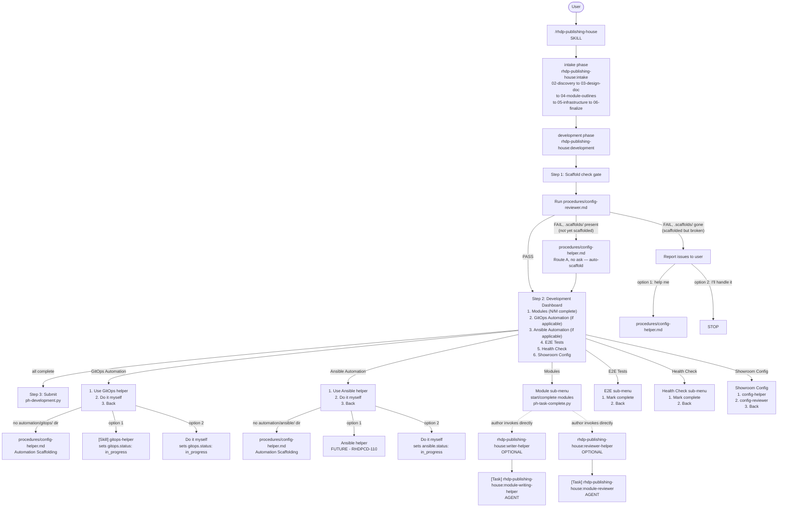

# Development Workflow Diagram

This diagram is the authoritative reference for the RHDP Publishing House development phase.
The development skill provides a numbered dashboard for 4 workstreams (modules, automation,
e2e, health check) plus showroom config. Writing, reviewing, and automation are optional
standalone helper skills the author invokes directly.

## Mermaid Diagram



## ASCII Diagram

```
User
  |
  +- /rhdp-publishing-house (SKILL)
      |
      +- intake phase --------------------------------------------------+
      |   rhdp-publishing-house:intake                                  |
      |   +- 02-discovery -> 03-design-doc -> 04-module-outlines        |
      |      -> 05-infrastructure -> 06-finalize                        |
      +-------------------------------------------------------------------+
      |
      +- development phase ----------------------------------------------+
      |   rhdp-publishing-house:development                              |
      |                                                                  |
      |   Step 1: Scaffold check gate                                    |
      |   +- Run procedures/config-reviewer.md                          |
      |      +- PASS -> proceed to Dashboard                            |
      |      +- FAIL, .scaffolds/ present (not yet scaffolded)          |
      |      |    -> auto-scaffold via config-helper.md Route A          |
      |      |       (no ask; single scaffold-plan confirmation only)    |
      |      +- FAIL, .scaffolds/ gone (scaffolded but broken)          |
      |           -> report issues, offer numbered options               |
      |                                                                  |
      |   Step 2: Development Dashboard (numbered options)               |
      |   +- 1. Modules           -> module sub-menu (start/complete)   |
      |   +- 2. GitOps Automation -> helper or DIY (if applicable)      |
      |   +- 3. Ansible Automation -> helper or DIY (if applicable)     |
      |   +- 4. E2E Tests         -> mark complete (placeholder)        |
      |   +- 5. Health Check      -> mark complete (placeholder)        |
      |   +- 6. Showroom Config   -> config-helper / config-reviewer    |
      |                                                                  |
      |   Step 3: Submission gate                                        |
      |   +- modules + all automation children complete -> ph-development.py |
      +---------------------------------------------------------------+
      |
      +- optional helper skills (NOT dispatched by development) --------+
      |   rhdp-publishing-house:writer-helper                            |
      |   +- [Task] rhdp-publishing-house:module-writing-helper (AGENT) |
      |                                                                  |
      |   rhdp-publishing-house:reviewer-helper                          |
      |   +- [Task] rhdp-publishing-house:module-reviewer (AGENT)       |
      |                                                                  |
      |   rhdp-publishing-house:gitops-helper                             |
      |   rhdp-publishing-house:ansible-helper (FUTURE - RHDPCD-110)    |
      +---------------------------------------------------------------+
```

## Legend

| Marker | Meaning |
|---|---|
| `[Task]` | Agent invocation via Task tool with `subagent_type` parameter |
| `[Skill]` | Skill invocation via Skill tool |
| `FUTURE` | Not yet built — dispatch path is wired but destination skill does not exist yet |
| `OPTIONAL` | Not dispatched by `development` — the author invokes it directly whenever they want |

**Note:** FTL (`ftl:*`) is NOT in this diagram. Mitesh owns FTL validation separately as a standalone workflow.
