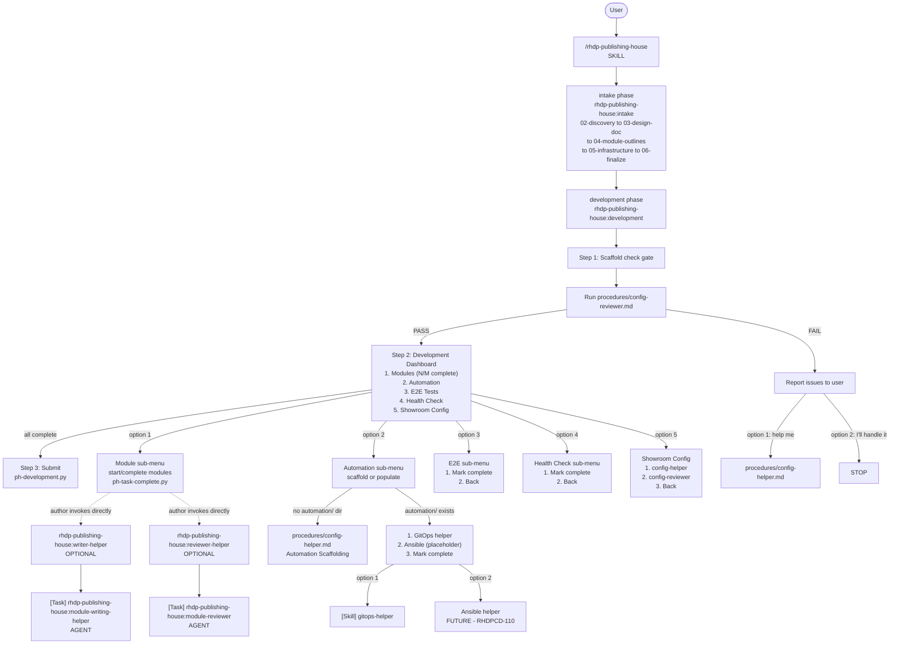

# Development Workflow Diagram

This diagram is the authoritative reference for the RHDP Publishing House development phase.
The development skill provides a numbered dashboard for 4 workstreams (modules, automation,
e2e, health check) plus showroom config. Writing, reviewing, and automation are optional
standalone helper skills the author invokes directly.

## Mermaid Diagram



## ASCII Diagram

```
User
  |
  +- /rhdp-publishing-house (SKILL)
      |
      +- intake phase --------------------------------------------------+
      |   rhdp-publishing-house:intake                                  |
      |   +- 02-discovery -> 03-design-doc -> 04-module-outlines        |
      |      -> 05-infrastructure -> 06-finalize                        |
      +-------------------------------------------------------------------+
      |
      +- development phase ----------------------------------------------+
      |   rhdp-publishing-house:development                              |
      |                                                                  |
      |   Step 1: Scaffold check gate                                    |
      |   +- Run procedures/config-reviewer.md                          |
      |      +- PASS -> proceed to Dashboard                            |
      |      +- FAIL -> report issues, offer numbered options            |
      |                                                                  |
      |   Step 2: Development Dashboard (numbered options)               |
      |   +- 1. Modules    -> module sub-menu (start/complete)           |
      |   +- 2. Automation -> config-helper scaffold / gitops-helper        |
      |   +- 3. E2E Tests  -> mark complete (placeholder)               |
      |   +- 4. Health Check -> mark complete (placeholder)              |
      |   +- 5. Showroom Config -> config-helper / config-reviewer       |
      |                                                                  |
      |   Step 3: Submission gate                                        |
      |   +- ALL 4 workstreams complete -> ph-development.py             |
      +---------------------------------------------------------------+
      |
      +- optional helper skills (NOT dispatched by development) --------+
      |   rhdp-publishing-house:writer-helper                            |
      |   +- [Task] rhdp-publishing-house:module-writing-helper (AGENT) |
      |                                                                  |
      |   rhdp-publishing-house:reviewer-helper                          |
      |   +- [Task] rhdp-publishing-house:module-reviewer (AGENT)       |
      |                                                                  |
      |   rhdp-publishing-house:automation-helper                       |
      |   +- gitops  -> [Skill] gitops-helper                            |
      |   +- ansible -> [Skill] ansible-helper (FUTURE - RHDPCD-110)    |
      +---------------------------------------------------------------+
```

## Legend

| Marker | Meaning |
|---|---|
| `[Task]` | Agent invocation via Task tool with `subagent_type` parameter |
| `[Skill]` | Skill invocation via Skill tool |
| `FUTURE` | Not yet built — dispatch path is wired but destination skill does not exist yet |
| `OPTIONAL` | Not dispatched by `development` — the author invokes it directly whenever they want |

**Note:** FTL (`ftl:*`) is NOT in this diagram. Mitesh owns FTL validation separately as a standalone workflow.
